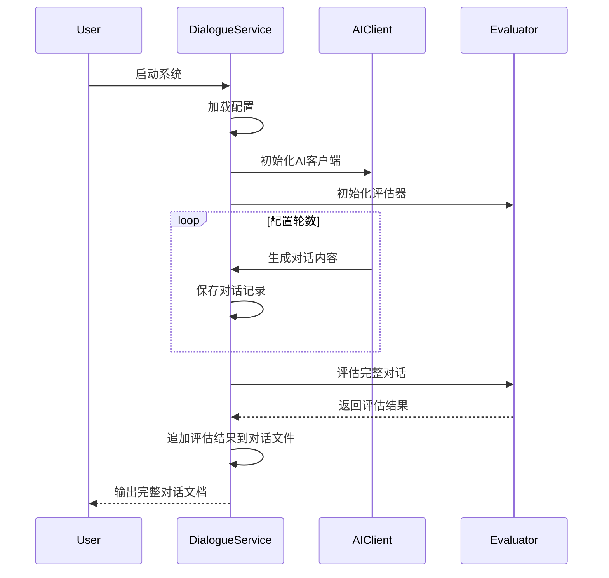

# ai-talk

这是一个基于多个大语言模型的AI对话生成系统，专注于生成高质量的播客对话内容。

## 功能特点

- 支持多个大语言模型（Deepseek、Groq、Cerebras）
- 智能对话生成
- 自动质量评估
- 灵活的配置系统
- 对话历史保存

## 系统架构

### 核心组件

1. **DialogueService**: 对话服务核心
   - 管理对话流程
   - 协调多个AI客户端
   - 保存对话历史
   - 评估对话质量

2. **AIClient**: AI对话客户端
   - 支持多个LLM模型
   - 角色设定管理
   - 对话生成控制

3. **DialogueEvaluator**: 对话评估器
   - 实时质量评估
   - 评分反馈
   - 对话优化建议

### 交互流程



## 技术细节

### 对话生成流程

1. **初始化阶段**
   - 加载环境变量和配置
   - 创建必要的目录结构
   - 初始化日志系统

2. **对话阶段**
   - 角色轮流发言
   - 实时质量控制
   - 动态调整对话方向

3. **输出阶段**
   - Markdown格式保存
   - 对话质量报告
   - 系统运行日志

### 配置项说明

- `dialogue.rounds`: 对话轮数
- `dialogue.characters`: 角色配置
- `dialogue.output`: 输出设置
- `models`: LLM模型配置

## 安装步骤

1. 克隆仓库：
```bash
git clone https://github.com/yourusername/ai-talk.git
cd ai-talk
```

2. 创建并激活虚拟环境：
```bash
python -m venv venv
source venv/bin/activate  # Linux/Mac
# 或
.\venv\Scripts\activate  # Windows
```

3. 安装依赖：
```bash
pip install -r requirements.txt
```

4. 配置环境变量：
```bash
cp .env.example .env
# 编辑 .env 文件，填入你的 API 密钥
```

## 使用方法

1. 运行对话系统：
```bash
python main.py
```

2. 查看输出：
输出文件将保存在 `output` 目录下，格式为 Markdown。

## 目录结构

```
.
├── src/
│   ├── client.py      # API 客户端
│   ├── service.py     # 对话服务
│   └── evaluator.py   # 评估器
├── main.py            # 主程序
├── main.json          # 配置文件
├── requirements.txt   # 依赖列表
└── README.md         # 说明文档
```

## 注意事项

- 请确保 API 密钥的安全性
- 不要将 `.env` 文件提交到版本控制系统
- 建议定期备份对话历史

## License

MIT License